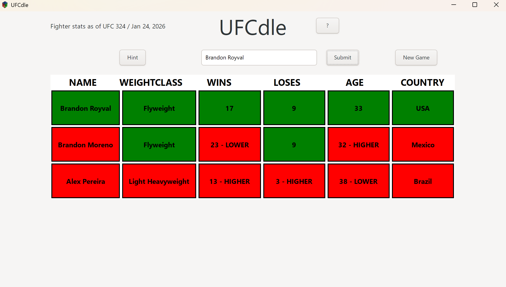

# UFCdle
A Wordle-style guessing game for UFC fighters built in C with GTK 3.

# How to Play
A random UFC fighter is selected at the start of each game. Guess fighters 
by typing their name and pressing Submit. Each guess reveals stats compared 
to the mystery fighter:
- 🟩 GREEN = correct
- 🟥 RED = incorrect
- HIGHER / LOWER = the answer's stat is higher or lower than your guess

Use the hints button if you get stuck. Guess the fighter in as few tries as possible!

# How to Build
### Requirements
- gcc
- GTK 3
- MSYS2 (Windows)

### Steps
1. cd path-to-your-project
2. gcc main.c fighters.c -o run.exe 'pkg-config --cflags --libs gtk+-3.0'
3. ./run.exe
